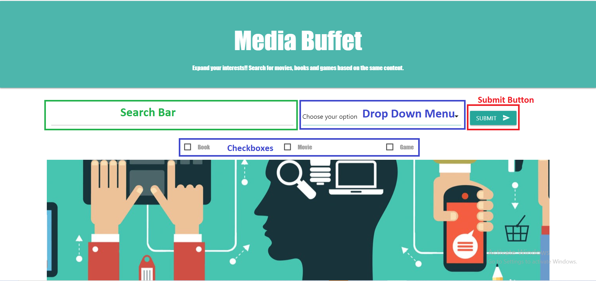
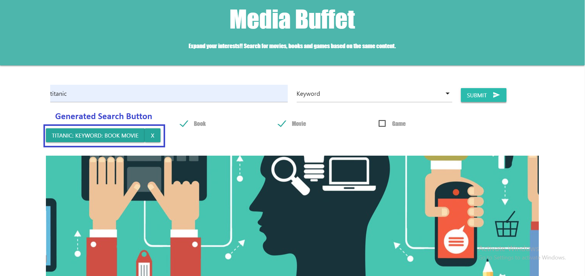

## Media Buffet: A Multi Media Search Tool Application

the link to our page is shown below:
https://jlovejo2.github.io/Multi-Media-Search-App/

## Table of Contents
* [Version 1.0](#version-1.0)
* [The User Interface](#the-user-interface)
* [How To Use](#how-to-use)
* [Apis Used](#apis-used)
* [CSS Framework](#css-framework)
* [Team Members](#team-members)
* [Coding Languages Used](#coding-languages-used)
* [Functions Used](#functions-used)
* [Known Issues With Code](#known-issues-with-code)

## Version 1.0
* Media Buffet is a website that can search movies, books, and video games to find like material.
* For example: Really enjoy the Thor movies? Want to learn what books and games are out there featuring the characters from Thor? Search by keyword Thor to get back multiple multi-media results based on the character Thor. 

## The User Interface:
* The landing page contains a search bar, dropdown menu to select your search criteria (title or keyword), checkbox buttons to select your options, and a submit button that renders the results based on the user's selections. 

* The landing page will also generate a button under the search criteria location that stores that data of the search and will perform the search again when clicked.  Also has a close button to remove it.

* At the bottom of the page there are collapsible elements that the results are generated into, broken down by selection (Movies, Books, Games). When results are generated into the collabisble they are automatically set to open and there is a badge at the top that (ideally) brings back the number of search results.

## How To Use
* The user types in a desired value into search input
* Then the user chooses their option from the dropwdown menu
* After that they decide what combination of movies,books, and games they want and select desired with checkboxes.
* Note: Modals will let user no when they forget to select search criteria
* To start search they click the submit button on the right

## API's Used:
Movies - OMDB: Open Movie Database
Books - Google Books
Games - RAWG

## CSS Framework:
Materialize

## Team Members:
James Lovejoy
Kobii Hoyos-Watkins
Martin Munoz
Sergio Perez
Iliana Vargas

## Coding Languages Used
* HTML
* Materialize
* CSS
* Javascript
* jquery

## Functions Used
* init - This function pulls the information from localStorage searchedCityNames array and generates the buttons for them.
* userAPISearch(userSearchValue, dropDownValue, bookCheckedBool, movieCheckedBool, gameCheckedBool) - This function is a generalized function that performs all the API searchs based on the given user search critieria. This function is called in multiple click events.
* saveUserInput(userSearchValue, dropDownOption, bookCheck, movieCheck, gameCheck) - This function saves the user search data criteria to userSearchObject which is then saved to localStorage.
* renderSearchButtons(userSearchValue, dropDownOption, bookCheck, movieCheck, gameCheck) - This function that renders the search buttons and close button list under the search bar
* googleBooksTitleQuery(searchCriteria, apiKey) - This function sets the query url for searching by title and then calls the googelbooksQuery function.
* googleBooksKeywordQuery(searchCriteria, apiKey) - This function sets the query url for searching by keyword and then calls the googelbooksQuery function. 
* googleBooksQuery(googleBooksURL) - This function is set to run an ajax query to googlebooks api.  The parameter delivered for the function is the query url.
* OMDBTitleQuery(movie, apiKey) - This function essentially changes the url for the generic OMDB ajax query to one that searches specifically for the title of the movie.
* OMDBKeywordQuery(keyword, apiKey) - This function changes the url for OMDB ajax query to one that searches for for movies based on a keyword.
* rawgKeywordQuery(searchCriteria) - This function performs the AJAX query to the Rawg (video Game) API based on the results including the user search value in the title
* rawgTitleQuery(searchCriteria) - This function performs the AJAX query to the Rawg API with the title matching the user search value.
* genTitleImgFromQuery(mainDiv, column, name, img) - This function grabs the game name and image from the Rawg Api and appends it into a column div and then appends that column into the mainDiv parameter.
* genGenreList(mainDiv, column, listDiv, respObject) - This function grabs the genre object from the Rawg Api and places the info into a list which is appended into a column.  That column is then appened to the mainDiv parameter.
* genAuthorList(mainDiv, column, listDiv, respObject) - This function grabs an array appends each element to a list item.  Appends that to a list. Puts the list in a column.  And then the column in a  specified div.
* noResultsFound(mainDiv) - This function generates a row div with text "No results found" into the div specified as the parameter. 
* CapitalizeWords(string) - This function is used because Rawg api capitalizes the first letters of all its game titles.  So the user search value is run through this function in the rawg query functions above

## Known Issues With Code
* Occasionally the last rendered search button will not delete from the page.  However, when you refresh the page it is not rendered back meaning it was deleted from localStorage
* Collapsible div badges show a different number than the actual amount of results rendered into divs.
* Rawg API has the results delivered in pages so the code for our rawg search only searches the 20 results on the first page
* Javascript file is extremely large.  Would be nice if it was in multiple javascript files so it can be edited and worked on by multiple coders with more ease.
